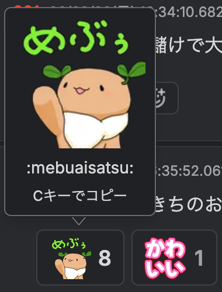

# mebuki-emoji-userscript

めぶきちゃんの絵文字にマウスを乗せると拡大表示するユーザースクリプトです。

## 概要

- 絵文字にマウスを乗せると、より大きな画像表示＆になります。
- TamperMonkey などのユーザースクリプト拡張で利用できます。

## 特徴

- マウスオーバーで絵文字を拡大表示（レス内と絵文字ボタン）
- レス内の絵文字はクリックでタグをクリップボードへコピー。
  - 

## TamperMonkey での利用方法

1. [Tampermonkey をインストール](https://www.tampermonkey.net/)
2. ↓をクリックしてユーザースクリプトをインストール
   - [インストール](https://raw.githubusercontent.com/sissis-source/mebuki-emoji-userscript/refs/heads/main/mebuki-emoji.user.js)
